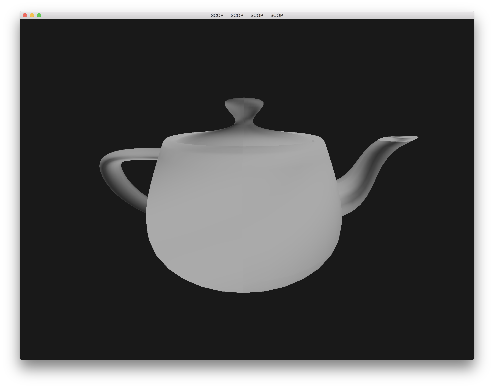
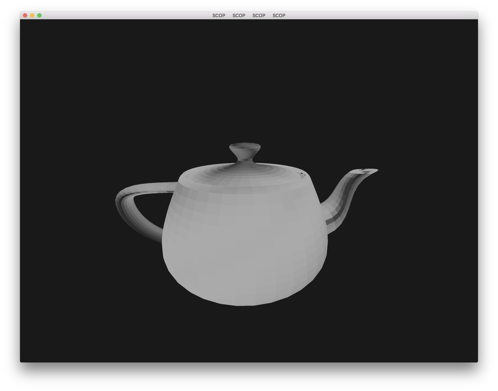
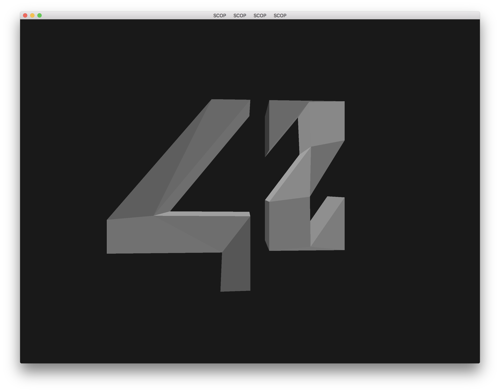
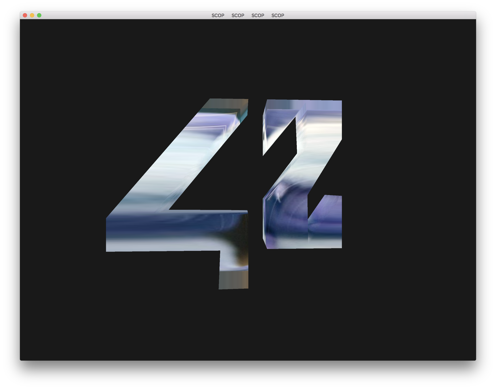
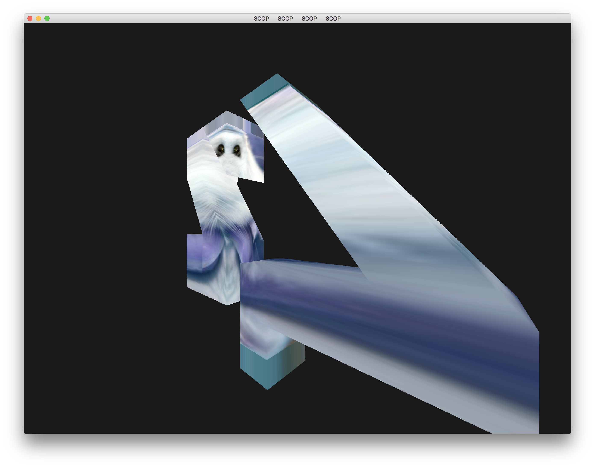

# Scop
3D .obj file visualizer
## Usage
```./scop [.obj file]```
## Keys
To control camera locaction/rotation: ```w a s d, arrows```
To control object: ```numpad 8 4 6 2```
To toggle object translate/rotate mode: ```r```
To apply cropster: ```1```

## What is a cropster?
just a .tga hamster texture (check resource folder)

## Screenshots
Teapot  
  
Hard edged version
  
42 logo  
  
42 logo with cropster applied  
  
The Eyes...  
  
